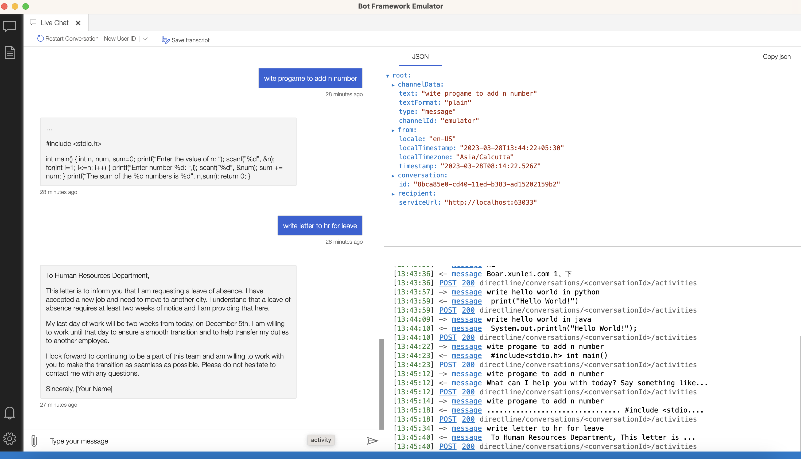

## This repository provides a sample implementation of integrating [ChatGPT](https://platform.openai.com/) with [Microsoft Bot Framework](https://dev.botframework.com) using Node.js.

## Prerequisites
###### Before getting started, you will need the following:
- Node.js installed on your machine 16 or higher
- Microsoft Bot Framework Emulator
- Get ChatGPT OpenAPI Key from (https://platform.openai.com/account/api-keys)

## To try this sample

- Clone the repository

    ```bash
    git clone https://github.com/aakashkag/microsoft-botframework-chatgpt-integration.git
    ```

- In .env set OPENAI_API_KEY value: [Get Open API Key here](https://platform.openai.com/account/api-keys)

- install dependency
    ```bash
    npm i
    ```

- Run the sample
    ```bash
    node index.js
    ```

## Testing the bot using Bot Framework Emulator

[Bot Framework Emulator](https://github.com/microsoft/botframework-emulator) is a desktop application that allows bot developers to test and debug their bots on localhost or running remotely through a tunnel.

- Install the latest Bot Framework Emulator from [here](https://github.com/Microsoft/BotFramework-Emulator/releases)

### Connect to the bot using Bot Framework Emulator

- Launch Bot Framework Emulator
- File -> Open Bot
- Enter a Bot URL of `http://localhost:3978/api/messages`

### Sample Output


## Further reading

- [Bot Framework Documentation](https://docs.botframework.com)
- [Bot Framework Sample Codes](https://github.com/microsoft/BotBuilder-Samples)
- [Open API Documentation](https://platform.openai.com/docs/guides/chat/introduction)

## Developer Help:
Aakash Kag: [https://www.linkedin.com/in/aakashkag/](https://www.linkedin.com/in/aakashkag/)

